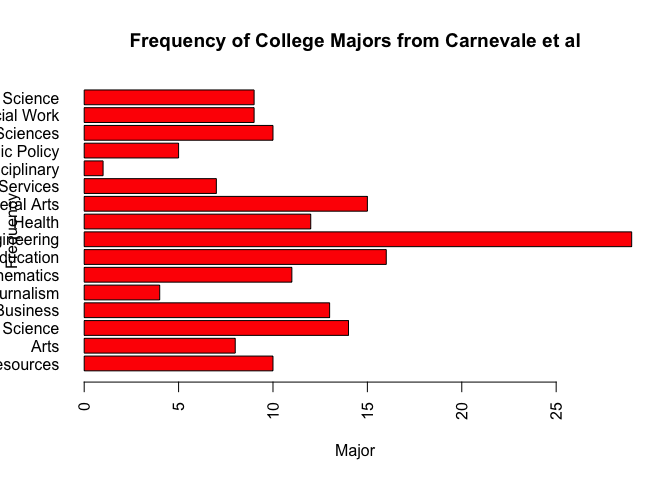

## Get Five Thirty Eight Data

We get some data from the folks at Five Thirty Eight to do some analysis. The data is from a file on college_recent_grads. We pull it in and get some information about the file.

First I had to be sure to install the `fivethirtyeight` package and run it.


```r
install.packages("fivethirtyeight", repos =  "http://cran.us.r-project.org")
```

```
## 
## The downloaded binary packages are in
## 	/var/folders/3b/4yr_49g17gn2h9_h6n5zyl6w0000gr/T//RtmpoouwvA/downloaded_packages
```

```r
library(fivethirtyeight)
df <- college_recent_grads
vignette("fivethirtyeight", package = "fivethirtyeight")
```

```
## starting httpd help server ... done
```

```r
dim(df)
```

```
## [1] 173  21
```

```r
colnames(df)
```

```
##  [1] "rank"                        "major_code"                 
##  [3] "major"                       "major_category"             
##  [5] "total"                       "sample_size"                
##  [7] "men"                         "women"                      
##  [9] "sharewomen"                  "employed"                   
## [11] "employed_fulltime"           "employed_parttime"          
## [13] "employed_fulltime_yearround" "unemployed"                 
## [15] "unemployment_rate"           "p25th"                      
## [17] "median"                      "p75th"                      
## [19] "college_jobs"                "non_college_jobs"           
## [21] "low_wage_jobs"
```

## Look at Information on Major Categories

Here we get the number of columns of data then focus on the major categories. We create a plot of how many observations there are in each major category.


```r
length(colnames(df))
```

```
## [1] 21
```

```r
major_count <- table(df$major_category)
barplot(major_count, las=2, main = "Frequency of College Majors from Carnevale et al", xlab = "Major", ylab = "Frequency", horiz = TRUE, col = "red")
```

<!-- -->

```r
write.csv(df,row.names = FALSE, file = "/Users/tq/Dropbox/Senkungu Fam/Education/SMU/Courses/MSDS 6306 Doing Data Science/GitHub Repo/smu-msds-homework/6306-homework/unit04/college_recent_grads.csv")
```

##Github Repository

Here is a link to my homework Git repository

https://github.com/tikisen/smu-msds-homework 
