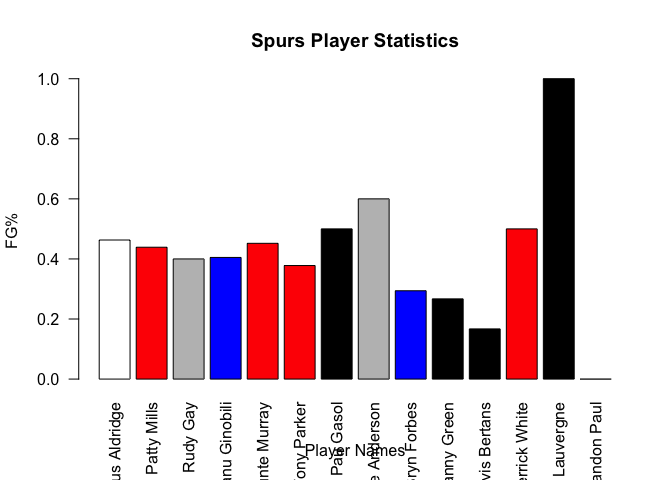

# Doing Data Science Unit 09 Assignment

## Question 1 Harry Potter Cast

### b. Scrape IMDB Page for Cast Table


```r
#Install and load the rvest package
install.packages("rvest", repo = "https://cran.rstudio.com")
```

```
## 
## The downloaded binary packages are in
## 	/var/folders/3b/4yr_49g17gn2h9_h6n5zyl6w0000gr/T//RtmpQF0EnN/downloaded_packages
```

```r
library('rvest')
```

```
## Loading required package: xml2
```

```r
#Specifying the url for desired website to be scrapped
url <- 'https://www.imdb.com/title/tt1201607/fullcredits?ref_=tt_ql_1'

#load libraries
library(RCurl)
```

```
## Loading required package: bitops
```

```r
library(XML)
```

```
## Warning: package 'XML' was built under R version 3.4.4
```

```
## 
## Attaching package: 'XML'
```

```
## The following object is masked from 'package:rvest':
## 
##     xml
```

```r
#xml download method
character_tables <- readHTMLTable(url)

#download the tables and pull the cast table
tabs = getURL(url)
cast <- readHTMLTable(tabs, stringsAsFactors = F, which = 3)
```

### c. Clean up the table


```r
#add names to columns
colnames(cast) <- c("","Actor","","Character")

#remove empty or meaningless columns
cast <- cast[,-c(1,3)]
```

### d. Split Actor Names

```r
#load library
library(tidyr)
```

```
## 
## Attaching package: 'tidyr'
```

```
## The following object is masked from 'package:RCurl':
## 
##     complete
```

```r
#find first name and split
cast_final <- extract(cast, Actor, into = c("Actor FirstName", "Actor LastName"), "([^ ]+) (.*)", remove = T)
```

### e. First 10 Rows of Data


```r
head(cast_final, 10)
```

```
##    Actor FirstName Actor LastName
## 1            Ralph        Fiennes
## 2          Michael         Gambon
## 3             Alan        Rickman
## 4           Daniel      Radcliffe
## 5           Rupert          Grint
## 6             Emma         Watson
## 7           Evanna          Lynch
## 8         Domhnall        Gleeson
## 9         Clémence          Poésy
## 10         Warwick          Davis
##                                              Character
## 1                                       Lord Voldemort
## 2                           Professor Albus Dumbledore
## 3                              Professor Severus Snape
## 4                                         Harry Potter
## 5                                          Ron Weasley
## 6                                     Hermione Granger
## 7                                        Luna Lovegood
## 8                                         Bill Weasley
## 9                                       Fleur Delacour
## 10 Griphook /  \n            Professor Filius Flitwick
```

## 2. Sports Ball

### b. Scrape Stats Table

```r
#name url
hoops_url <- 'http://www.espn.com/nba/team/stats/_/name/sa/san-antonio-spurs'

#load libraries
library(RCurl)
library(XML)

#download tables
hoops_tabs = getURL(hoops_url)

#pull and ID stats table
shooting_stats <- readHTMLTable(hoops_tabs, header = TRUE, stringsAsFactors = F, which = 2)
```

### c. Clean up Stats Table

```r
#Find the last row with totals
last_row <- nrow(shooting_stats)
last_row
```

```
## [1] 16
```

```r
#keep all except totals row
shooting_stats<-shooting_stats[1:(last_row-1),]

#make header row names in first row
#create a header function
header.true <- function(df) {
  names(df) <- as.character(unlist(df[1,]))
  df[-1,]
}

#assign header names to stats table
shooting_stats <- header.true(shooting_stats)

#split off player position
shooting_stats_final <- extract(shooting_stats, PLAYER, into = c("PLAYER", "POSITION"), "([^,]+),(.*)")

#check column types
sapply(shooting_stats_final, class)
```

```
##      PLAYER    POSITION         FGM         FGA         FG%         3PM 
## "character" "character" "character" "character" "character" "character" 
##         3PA         3P%         FTM         FTA         FT%         2PM 
## "character" "character" "character" "character" "character" "character" 
##         2PA         2P%         PPS        AFG% 
## "character" "character" "character" "character"
```

```r
#select columns with numbered stats
cols = c(3:16)

#change type to numeric
shooting_stats_final[,cols] = apply(shooting_stats_final[,cols], 2, function(x) as.numeric(as.character(x))) 

#show changed class of columns
sapply(shooting_stats_final, class)
```

```
##      PLAYER    POSITION         FGM         FGA         FG%         3PM 
## "character" "character"   "numeric"   "numeric"   "numeric"   "numeric" 
##         3PA         3P%         FTM         FTA         FT%         2PM 
##   "numeric"   "numeric"   "numeric"   "numeric"   "numeric"   "numeric" 
##         2PA         2P%         PPS        AFG% 
##   "numeric"   "numeric"   "numeric"   "numeric"
```

```r
shooting_stats_final
```

```
##               PLAYER POSITION FGM  FGA   FG% 3PM 3PA   3P% FTM FTA  FT%
## 2  LaMarcus Aldridge       PF 7.4 16.0 0.463 0.6 1.0 0.600 8.2 8.4 0.98
## 3        Patty Mills       PG 5.0 11.4 0.439 2.6 7.0 0.371 0.8 1.0 0.80
## 4           Rudy Gay       SF 5.2 13.0 0.400 0.8 3.6 0.222 1.0 1.8 0.56
## 5      Manu Ginobili       SG 3.0  7.4 0.405 1.2 3.6 0.333 1.8 2.2 0.82
## 6    Dejounte Murray       PG 2.8  6.2 0.452 0.8 1.2 0.667 1.4 1.8 0.78
## 7        Tony Parker       PG 2.8  7.4 0.378 0.0 1.0 0.000 1.0 1.4 0.71
## 8          Pau Gasol        C 2.0  4.0 0.500 0.2 0.6 0.333 1.8 2.0 0.90
## 9      Kyle Anderson       SF 2.4  4.0 0.600 0.0 0.8 0.000 0.6 0.8 0.75
## 10       Bryn Forbes       SG 1.3  4.3 0.294 0.5 2.3 0.222 1.3 1.8 0.71
## 11       Danny Green        G 1.6  6.0 0.267 1.0 4.0 0.250 0.0 0.0 0.00
## 12     Davis Bertans        C 0.6  3.6 0.167 0.6 3.2 0.188 1.6 2.2 0.73
## 13     Derrick White       PG 1.0  2.0 0.500 0.3 0.7 0.500 0.0 0.0 0.00
## 14 Joffrey Lauvergne        C 1.0  1.0 1.000 0.0 0.0 0.000 0.0 0.0 0.00
## 15      Brandon Paul       SG 0.0  0.0 0.000 0.0 0.0 0.000 0.0 0.0 0.00
##    2PM  2PA   2P%   PPS AFG%
## 2  6.8 15.0 0.453 1.475 0.48
## 3  2.4  4.4 0.545 1.175 0.55
## 4  4.4  9.4 0.468 0.938 0.43
## 5  1.8  3.8 0.474 1.216 0.49
## 6  2.0  5.0 0.400 1.258 0.52
## 7  2.8  6.4 0.438 0.892 0.38
## 8  1.8  3.4 0.529 1.500 0.53
## 9  2.4  3.2 0.750 1.350 0.60
## 10 0.8  2.0 0.375 1.000 0.35
## 11 0.6  2.0 0.300 0.700 0.35
## 12 0.0  0.4 0.000 0.944 0.25
## 13 0.7  1.3 0.500 1.167 0.58
## 14 1.0  1.0 1.000 2.000 1.00
## 15 0.0  0.0 0.000 0.000 0.00
```

### d. Create colorful barchart

```r
barplot(shooting_stats_final$`FG%`, names.arg = shooting_stats_final$PLAYER, las = 2, main = "Spurs Player Statistics", xlab = "Player Names", ylab = "FG%", col=ifelse(grepl("PG", shooting_stats_final$POSITION), "red", ifelse(grepl("SG", shooting_stats_final$POSITION), "blue", ifelse(grepl("SF", shooting_stats_final$POSITION), "grey", ifelse(grepl("PF", shooting_stats_final$POSITION),"white", "black"))))) #used ifelse to select color by position
```

<!-- -->
