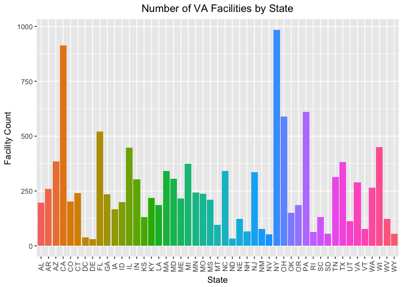
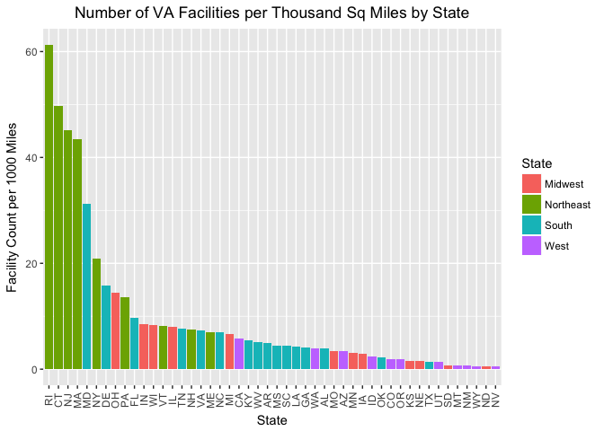

```r
knitr::opts_chunk$set(echo = TRUE)
```

## Mental Health Clinics

### b. State Abbreviations


```r
#load the experimental VA data
load("~/Dropbox/Senkungu Fam/Education/SMU/Courses/MSDS 6306 Doing Data Science/Homework/Assignment 10/N-MHSS-2015-DS0001-bndl-data-r/N-MHSS-2015-DS0001-data/N-MHSS-2015-DS0001-data-r.rda")

#Create a list of the unique state names
state_abbr <- unique(mh2015_puf$LST)
state_abbr
```

```
##  [1] AL     AK     AZ     AR     CA     CO     CT     DE     DC     FL    
## [11] GA     HI     ID     IL     IN     IA     KS     KY     LA     ME    
## [21] MD     MA     MI     MN     MS     MO     MT     NE     NV     NH    
## [31] NJ     NM     NY     NC     ND     OH     OK     OR     PA     RI    
## [41] SC     SD     TN     TX     UT     VT     VA     WA     WV     WI    
## [51] WY     AS     GU     PR     VI    
## 55 Levels: AK     AL     AR     AS     AZ     CA     CO     ... WY
```

### c. Filter to only CONUS medical center count


```r
#load dplyr to do counts
library(dplyr)
```

```
## 
## Attaching package: 'dplyr'
```

```
## The following objects are masked from 'package:stats':
## 
##     filter, lag
```

```
## The following objects are masked from 'package:base':
## 
##     intersect, setdiff, setequal, union
```

```r
#trim blank spaces in LST (state) column. It was jacking up the logical statement to subset the data frame
mh2015_puf$LST <- trimws(mh2015_puf$LST)

#create a subset of CONUS states
mh2015_puf_conus <- subset(mh2015_puf, !(LST %in% c("AK", "HI", "AS", "GU", "PR", "VI")))
#summary(mh2015_puf)

#make function to count occurences of something 
count_up <- function(x) {
  length(unique(x))
}

#use the function to count and aggregate the states
fac_per_state_conus <- aggregate(FUN = count_up, data=mh2015_puf_conus, . ~ LST)

#display a few of the states
head(fac_per_state_conus)
```

```
##   LST CASEID MHINTAKE MHDIAGEVAL MHREFERRAL TREATMT ADMINSERV SETTINGIP
## 1  AL    197        2          2          2       2         2         2
## 2  AR    259        2          2          2       2         2         2
## 3  AZ    386        2          2          2       2         2         2
## 4  CA    913        2          2          2       2         2         2
## 5  CO    203        2          2          2       2         2         2
## 6  CT    241        2          2          2       2         2         2
##   SETTINGRC SETTINGDTPH SETTINGOP FACILITYTYPE FOCUS OWNERSHP PUBLICAGENCY
## 1         2           2         2           11     3        3            5
## 2         2           2         2            9     3        3            4
## 3         2           2         2           11     3        3            7
## 4         2           2         2           10     4        3            5
## 5         2           2         2           10     3        3            5
## 6         2           2         2           11     3        3            5
##   TREATPSYCHOTHRPY TREATFAMTHRPY TREATGRPTHRPY TREATCOGTHRPY
## 1                2             2             2             2
## 2                2             2             2             2
## 3                2             2             2             2
## 4                2             2             2             2
## 5                2             2             2             2
## 6                2             2             2             2
##   TREATDIALTHRPY TREATBEHAVMOD TREATDUALMHSA TREATTRAUMATHRPY
## 1              2             2             2                2
## 2              2             2             2                2
## 3              2             2             2                2
## 4              2             2             2                2
## 5              2             2             2                2
## 6              2             2             2                2
##   TREATACTVTYTHRPY TREATELECTRO TREATTELEMEDINCE TREATPSYCHOMED TREATOTH
## 1                2            2                2              2        2
## 2                2            2                2              2        2
## 3                2            2                2              2        2
## 4                2            2                2              2        2
## 5                2            2                2              2        2
## 6                2            2                2              2        2
##   NOTREAT ASSERTCOMM MHINTCASEMGMT MHCASEMGMT MHCOURTORDERED MHCHRONIC
## 1       3          2             2          2              2         2
## 2       2          2             2          2              2         2
## 3       3          2             2          2              2         2
## 4       2          2             2          2              2         2
## 5       2          2             2          2              2         2
## 6       2          2             2          2              2         2
##   ILLNESSMGMT PRIMARYCARE DIETEXERCOUNSEL FAMPSYCHED MHEDUCATION MHHOUSING
## 1           2           2               2          2           2         2
## 2           2           2               2          2           2         2
## 3           2           2               2          2           2         2
## 4           2           2               2          2           2         2
## 5           2           2               2          2           2         2
## 6           2           2               2          2           2         2
##   SUPPHOUSING MHPSYCHREHAB MHVOCREHAB SUPPEMPLOY FOSTERCARE MHLEGAL
## 1           2            2          2          2          2       2
## 2           2            2          2          2          2       2
## 3           2            2          2          2          2       2
## 4           2            2          2          2          2       2
## 5           2            2          2          2          2       2
## 6           2            2          2          2          2       2
##   MHEMGCY MHSUICIDE MHCONSUMER MHTOBACCOUSE MHTOBACCOCESS MHNICOTINEREP
## 1       2         2          2            2             2             2
## 2       2         2          2            2             2             2
## 3       2         2          2            2             2             2
## 4       2         2          2            2             2             2
## 5       2         2          2            2             2             2
## 6       2         2          2            2             2             2
##   SMOKINGCESSATION MHOTH MHNOSVCS CHILDAD ADOLES YOUNGADULTS ADULT SENIORS
## 1                2     2        2       2      2           2     2       2
## 2                2     1        2       2      2           2     2       2
## 3                2     2        2       2      2           2     2       2
## 4                2     2        2       2      2           2     2       2
## 5                2     2        2       2      2           2     2       2
## 6                2     2        2       2      2           2     2       2
##   SED TAYOUNGADULTS SPMI SRVC63 ALZHDEMENTIA SRVC31 SPECGRPEATING SRVC116
## 1   2             2    2      2            2      2             2       2
## 2   2             2    2      2            2      2             2       2
## 3   2             2    2      2            2      2             2       3
## 4   2             2    2      2            2      2             2       3
## 5   2             2    2      2            2      2             2       2
## 6   2             2    2      2            2      2             2       2
##   POSTTRAUM TRAUMATICBRAIN SRVC113 SRVC114 SRVC115 SRVC62 SRVC61 SRVC32
## 1         2              2       2       2       2      2      2      2
## 2         2              2       2       2       2      2      2      2
## 3         2              2       2       2       2      2      2      2
## 4         2              2       2       2       2      2      2      2
## 5         2              2       2       2       2      2      2      2
## 6         2              2       2       2       2      2      2      2
##   SRVC35 NOSPECGRP CRISISTEAM2 HEARIMPAIR LANG LANGPROV LANG16 LANG_B
## 1      2         2           3          2    2        5      3      2
## 2      2         2           2          3    2        4      3      3
## 3      2         3           3          2    2        5      3      3
## 4      2         3           3          3    3        5      4      4
## 5      2         2           2          2    2        5      2      3
## 6      2         2           2          2    2        5      3      3
##   LANG1 LANG2 LANG3 LANG21 LANG4 LANG5 LANG6 LANG7 LANG8 LANG24 LANG9
## 1     2     2     2      2     2     2     2     3     2      2     2
## 2     3     3     3      3     3     3     3     3     3      3     3
## 3     3     3     3      3     3     3     3     3     3      3     3
## 4     3     3     4      3     3     4     4     4     4      4     4
## 5     3     2     2      3     2     2     2     2     2      2     3
## 6     2     2     2      2     2     2     3     3     3      3     3
##   LANG10 LANG22 LANG25 LANG26 LANG11 LANG19 LANG23 LANG12 LANG13 LANG14
## 1      2      2      2      2      2      2      2      2      2      2
## 2      3      3      3      3      3      3      3      3      3      3
## 3      3      2      3      3      3      3      3      3      3      3
## 4      4      4      4      4      4      4      4      4      4      4
## 5      3      2      2      2      2      3      2      3      2      2
## 6      3      3      3      3      2      3      3      3      3      3
##   LANG15 LANG20 LANG17 LANG18 SMOKINGPOLICY FEESCALE PAYASST REVCHK1
## 1      2      2      2      3             4        4       3       3
## 2      3      3      3      3             4        3       4       3
## 3      3      3      3      3             4        3       3       3
## 4      4      4      4      4             6        4       4       3
## 5      2      2      2      3             4        3       3       3
## 6      3      2      3      3             4        3       4       3
##   REVCHK2 REVCHK8 REVCHK5 REVCHK10 FUNDSMHA FUNDSTATEWELFARE FUNDSTATEJUV
## 1       3       3       3        3        3                3            3
## 2       3       3       3        3        3                3            3
## 3       3       3       3        3        3                3            3
## 4       3       3       3        3        3                3            3
## 5       3       3       3        3        3                3            3
## 6       3       3       3        3        3                3            4
##   FUNDSTATEEDUC FUNDOTHSTATE FUNDLOCALGOV FUNDCSBG FUNDCMHG REVCHK15
## 1             3            3            3        3        3        3
## 2             3            3            3        3        3        3
## 3             3            3            3        3        3        3
## 4             3            3            3        3        3        3
## 5             3            3            3        3        3        3
## 6             4            4            4        4        4        4
##   FUNDVA REVCHK17 REVCHK2A LICENMH LICENSED LICENPH LICENSEDFCS LICENHOS
## 1      3        3        2       3        3       3           3        3
## 2      3        3        3       3        3       3           3        3
## 3      3        3        3       3        3       3           3        3
## 4      3        3        3       3        3       3           3        3
## 5      3        3        3       3        3       3           3        3
## 6      4        4        3       3        3       3           3        3
##   JCAHO CARF COA CMS OTHSTATE
## 1     2    3   3   3        2
## 2     3    3   3   3        2
## 3     3    3   3   3        3
## 4     3    3   3   3        3
## 5     3    3   3   3        3
## 6     3    3   3   3        3
```

```r
#isolate the state abbreviations and counts
fac_per_state_conus_t <- fac_per_state_conus[,c(1,2)]

#rename the facility count column
colnames(fac_per_state_conus_t)[2] <- "facility_count"

#verify the class of the final table
class(fac_per_state_conus_t)
```

```
## [1] "data.frame"
```

```r
#display the state count table
fac_per_state_conus_t
```

```
##    LST facility_count
## 1   AL            197
## 2   AR            259
## 3   AZ            386
## 4   CA            913
## 5   CO            203
## 6   CT            241
## 7   DC             38
## 8   DE             31
## 9   FL            522
## 10  GA            236
## 11  IA            166
## 12  ID            199
## 13  IL            447
## 14  IN            304
## 15  KS            130
## 16  KY            218
## 17  LA            186
## 18  MA            340
## 19  MD            305
## 20  ME            217
## 21  MI            375
## 22  MN            243
## 23  MO            238
## 24  MS            210
## 25  MT             97
## 26  NC            342
## 27  ND             33
## 28  NE            122
## 29  NH             67
## 30  NJ            335
## 31  NM             77
## 32  NV             52
## 33  NY            984
## 34  OH            589
## 35  OK            150
## 36  OR            185
## 37  PA            612
## 38  RI             64
## 39  SC            132
## 40  SD             54
## 41  TN            314
## 42  TX            382
## 43  UT            111
## 44  VA            289
## 45  VT             76
## 46  WA            266
## 47  WI            451
## 48  WV            124
## 49  WY             54
```

### d. Create ggplot of facilities


```r
#load ggplot library for barplot
library(ggplot2)

#load dplyr to count rows
library(dplyr)

#make states column a factor to create colors per state
fac_per_state_conus_t$LST <- as.factor(fac_per_state_conus_t$LST)
#verify class as factor
class(fac_per_state_conus_t$LST)
```

```
## [1] "factor"
```

```r
#make all main labels centered
theme_update(plot.title = element_text(hjust = 0.5))

#create plot dataset
va_plot <- ggplot(data = fac_per_state_conus_t, aes(x=LST, y=facility_count, fill = LST)) + geom_bar(stat = "identity")

#display plot, rotate state labels and add table and axis lables
va_plot + theme(axis.text.x=element_text(angle = 90, vjust = 0.5), legend.position="none") + scale_color_manual(values = LST) + labs(title="Number of VA Facilities by State", fill = "State", x= "State", y= "Facility Count")
```

<!-- -->

```r
#these were some color options I was playing with and will return to experiment with later
#library(RColorBrewer)
#library(wesanderson)
#va_plot <- ggplot(data = fac_per_state_conus_t, aes(x=LST, y=facility_count, fill = LST)) + geom_bar(stat = "identity")
#va_plot + theme(axis.text.x=element_text(angle = 90, vjust = 0.5), legend.position="top") +scale_color_manual(values=wes_palette(name="Royal1"))
#https://ggplot2.tidyverse.org/reference/scale_manual.html
#https://ggplot2.tidyverse.org/reference/scale_brewer.html
```
## Clean and Bring in New Features

### a. Read statesize.csv into file

```r
statesize <- read.csv("~/Dropbox/Senkungu Fam/Education/SMU/Courses/MSDS 6306 Doing Data Science/Homework/Assignment 10/statesize.csv", header = TRUE)
fac_per_state_sizes <- merge(fac_per_state_conus_t, statesize, by.x = "LST", by.y = "Abbrev")
fac_per_state_sizes
```

```
##    LST facility_count      StateName SqMiles    Region
## 1   AL            197        Alabama   50750     South
## 2   AR            259       Arkansas   52075     South
## 3   AZ            386        Arizona  113642      West
## 4   CA            913     California  155973      West
## 5   CO            203       Colorado  103730      West
## 6   CT            241    Connecticut    4845 Northeast
## 7   DE             31       Delaware    1955     South
## 8   FL            522        Florida   53997     South
## 9   GA            236        Georgia   57919     South
## 10  IA            166           Iowa   55875   Midwest
## 11  ID            199          Idaho   82751      West
## 12  IL            447       Illinois   55593   Midwest
## 13  IN            304        Indiana   35870   Midwest
## 14  KS            130         Kansas   81823   Midwest
## 15  KY            218       Kentucky   39732     South
## 16  LA            186      Louisiana   43566     South
## 17  MA            340  Massachusetts    7838 Northeast
## 18  MD            305       Maryland    9775     South
## 19  ME            217          Maine   30865 Northeast
## 20  MI            375       Michigan   56539   Midwest
## 21  MN            243      Minnesota   79617   Midwest
## 22  MO            238       Missouri   68898   Midwest
## 23  MS            210    Mississippi   46914     South
## 24  MT             97        Montana  145556      West
## 25  NC            342 North Carolina   48718     South
## 26  ND             33   North Dakota   68994   Midwest
## 27  NE            122       Nebraska   76878   Midwest
## 28  NH             67  New Hampshire    8969 Northeast
## 29  NJ            335     New Jersey    7419 Northeast
## 30  NM             77     New Mexico  121365      West
## 31  NV             52         Nevada  109806      West
## 32  NY            984       New York   47224 Northeast
## 33  OH            589           Ohio   40953   Midwest
## 34  OK            150       Oklahoma   68679     South
## 35  OR            185         Oregon   96003      West
## 36  PA            612   Pennsylvania   44820 Northeast
## 37  RI             64   Rhode Island    1045 Northeast
## 38  SC            132 South Carolina   30111     South
## 39  SD             54   South Dakota   75898   Midwest
## 40  TN            314      Tennessee   41220     South
## 41  TX            382          Texas  261914     South
## 42  UT            111           Utah   82168      West
## 43  VA            289       Virginia   39598     South
## 44  VT             76        Vermont    9249 Northeast
## 45  WA            266     Washington   66582      West
## 46  WI            451      Wisconsin   54314   Midwest
## 47  WV            124  West Virginia   24087     South
## 48  WY             54        Wyoming   97105      West
```
I'm not sure what the question is referring to regarding the paste() function. All that I can see regarding any difference is that the state size table doesn't include DC. It may be a reference to the extra spaces in the LST column, but I stripped those out to make the subset in problem 1.

### b. Correct the state problem

I was able to merge the tables in part a. with no issues except the one stated regarding the stripped extra spaces.

### c. VA Hospitals per 1000 square miles


```r
#check data type to see if we can do math
str(fac_per_state_sizes)
```

```
## 'data.frame':	48 obs. of  5 variables:
##  $ LST           : Factor w/ 49 levels "AL","AR","AZ",..: 1 2 3 4 5 6 8 9 10 11 ...
##  $ facility_count: int  197 259 386 913 203 241 31 522 236 166 ...
##  $ StateName     : Factor w/ 50 levels "Alabama","Alaska",..: 1 4 3 5 6 7 8 9 10 15 ...
##  $ SqMiles       : int  50750 52075 113642 155973 103730 4845 1955 53997 57919 55875 ...
##  $ Region        : Factor w/ 4 levels "Midwest","Northeast",..: 3 3 4 4 4 2 3 3 3 1 ...
```

```r
#calculation and field creation for facilities per 1000 sq miles
fac_per_state_sizes$state_fac_rate <- fac_per_state_sizes$facility_count/(fac_per_state_sizes$SqMiles/1000)

#display table
fac_per_state_sizes
```

```
##    LST facility_count      StateName SqMiles    Region state_fac_rate
## 1   AL            197        Alabama   50750     South      3.8817734
## 2   AR            259       Arkansas   52075     South      4.9735958
## 3   AZ            386        Arizona  113642      West      3.3966315
## 4   CA            913     California  155973      West      5.8535772
## 5   CO            203       Colorado  103730      West      1.9570038
## 6   CT            241    Connecticut    4845 Northeast     49.7420021
## 7   DE             31       Delaware    1955     South     15.8567775
## 8   FL            522        Florida   53997     South      9.6672037
## 9   GA            236        Georgia   57919     South      4.0746560
## 10  IA            166           Iowa   55875   Midwest      2.9709172
## 11  ID            199          Idaho   82751      West      2.4048048
## 12  IL            447       Illinois   55593   Midwest      8.0405806
## 13  IN            304        Indiana   35870   Midwest      8.4750488
## 14  KS            130         Kansas   81823   Midwest      1.5887953
## 15  KY            218       Kentucky   39732     South      5.4867613
## 16  LA            186      Louisiana   43566     South      4.2693844
## 17  MA            340  Massachusetts    7838 Northeast     43.3784129
## 18  MD            305       Maryland    9775     South     31.2020460
## 19  ME            217          Maine   30865 Northeast      7.0306172
## 20  MI            375       Michigan   56539   Midwest      6.6325899
## 21  MN            243      Minnesota   79617   Midwest      3.0521120
## 22  MO            238       Missouri   68898   Midwest      3.4543818
## 23  MS            210    Mississippi   46914     South      4.4762757
## 24  MT             97        Montana  145556      West      0.6664102
## 25  NC            342 North Carolina   48718     South      7.0199926
## 26  ND             33   North Dakota   68994   Midwest      0.4783025
## 27  NE            122       Nebraska   76878   Midwest      1.5869299
## 28  NH             67  New Hampshire    8969 Northeast      7.4701750
## 29  NJ            335     New Jersey    7419 Northeast     45.1543335
## 30  NM             77     New Mexico  121365      West      0.6344498
## 31  NV             52         Nevada  109806      West      0.4735625
## 32  NY            984       New York   47224 Northeast     20.8368626
## 33  OH            589           Ohio   40953   Midwest     14.3823407
## 34  OK            150       Oklahoma   68679     South      2.1840737
## 35  OR            185         Oregon   96003      West      1.9270231
## 36  PA            612   Pennsylvania   44820 Northeast     13.6546185
## 37  RI             64   Rhode Island    1045 Northeast     61.2440191
## 38  SC            132 South Carolina   30111     South      4.3837800
## 39  SD             54   South Dakota   75898   Midwest      0.7114812
## 40  TN            314      Tennessee   41220     South      7.6176613
## 41  TX            382          Texas  261914     South      1.4584940
## 42  UT            111           Utah   82168      West      1.3508909
## 43  VA            289       Virginia   39598     South      7.2983484
## 44  VT             76        Vermont    9249 Northeast      8.2171046
## 45  WA            266     Washington   66582      West      3.9950737
## 46  WI            451      Wisconsin   54314   Midwest      8.3035681
## 47  WV            124  West Virginia   24087     South      5.1480051
## 48  WY             54        Wyoming   97105      West      0.5560991
```

### d. Plot of VAs per square thousand miles


```r
#create plot dataset
va_plot_sqft <- ggplot(data = fac_per_state_sizes, aes(x=reorder(LST, -state_fac_rate), y=state_fac_rate, fill = Region)) + geom_bar(stat = "identity")

#display plot, rotate state labels and add table and axis lables
va_plot_sqft + theme(axis.text.x=element_text(angle = 90, vjust = 0.5)) + scale_color_manual(values = Region) + labs(title="Number of VA Facilities per Thousand Sq Miles by State", fill = "State", x= "State", y= "Facility Count per 1000 Miles")
```

<!-- -->

### e. Observations of Facility Rate by Region

The rate of facilities seems to be particularly high in the northeast. I'm sure that's mostly due to population density and relatively smaller state size. 

The south seems to be pretty much in the midrage with the exception of Maryland and Deleware which while maybe technically in the South would be considered more Northeast than South today.

The West seems to be on the low end of the spectrum for exactly the opposite reason. There are large states with spread out populations. For example, California has almost twice the population of New York, but more than 3 times the size. If the military populations occur at anything like the same rate, it would make sense that the facilities per 1000 sq ft would be higher in New York.

Before beginning modeling, I'd suggest that we also do a heat map of population density and overlay the VA locations. Even better would be an overlay of a military veterans location heatmap with VA locations. If we could combine this with a proxy for where the need is like wait times or utilization rates, that would drive where new facilities are more needed.

Then do a random forest because that seems to be the asnwer to every issue. :)
